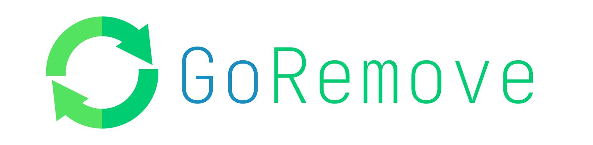

# 

> 把垃圾文件放入回收站

适用于 Linux、macOS

**目前实现功能**

- [x] 直接删除文件
- [x] 直接回收文件
- [x] 基于用户自定义大小判断文件多大直接删除
- [x] 撤销删除
- [x] 清空回收站
- [x] 不允许删除根目录第一层下的文件夹或者文件

### 安装

----

项目使用 Go 语言，可以直接下载发布的二进制文件和 `conf.yml` 文件

* 把下载的二进制文件移动到 `/usr/local/bin` 目录，选择你自己的操作系统

```shell
mv ./grm* /usr/local/bin
```

* 初始化回收站
```shell
grm init
```

* 把配置文件放入家目录的 `.conf/groremove` 目录

```shell
mv ./conf.yml ~/.conf/groremove
```


配置文件中的 `size: 1000000000` 表示的是文件大于 1G 会直接删除，这个数字的单位是 bit，也就是位

### 使用方法

----


* 基于配置文件中定义的文件大小，如果需要删除的文件大于定义的大小，则会直接删除，无法恢复

```shell
grm [file]
```

* 直接删除文件，不论大小

```shell
grm -r [file]
```

* 直接把文件放入回收站，不论大小

```shell
grm -m [file]
```

* 清空回收站文件

```shell
grm -e
```

* 恢复文件，会列出回收站的文件，输入文件名恢复到当前目录

```shell
grm -b
```

### FAQ

----

**回收的文件在哪里？**

回收的文件在家目录的 `.tmp` 文件夹中

